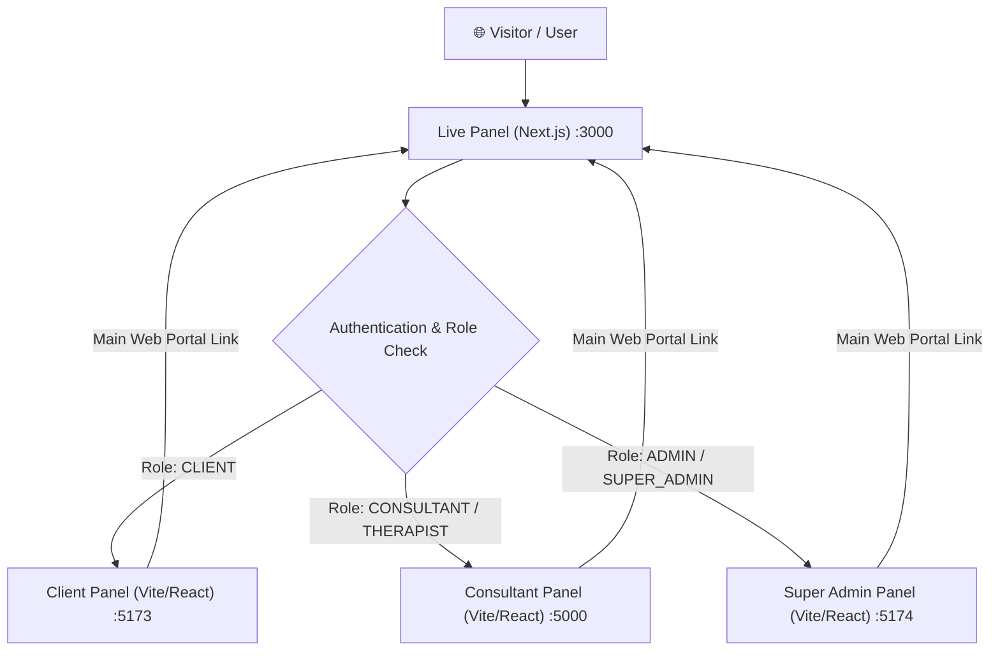

# Plan: Connect All 4 Hexpertify Panels According to Role

Connect and integrate the 4 panels (**Live Panel**, **Client Panel**, **Consultant Panel**, and **Super Admin Panel**) into a unified ecosystem based on user roles, dedicated port allocations, seamless navigation links, and role-aware auth flows.

---

## Architecture Overview

---

## Dedicated Port Allocations

To allow all 4 panels to run simultaneously in local development without port collision, the following ports are configured:

| Panel | Workspace Directory | Port | URL |
| :--- | :--- | :--- | :--- |
| **Live Panel** | `Live_Panel` | `3000` | `http://localhost:3000` |
| **Consultant Panel** | `Consultant_Panel/Therapy-Flow-Design/artifacts/hexpertify-dashboard` | `5000` | `http://localhost:5000` |
| **Client Panel** | `Client_Panel/Client-Dashboard-Pro/artifacts/client-dashboard` | `5173` | `http://localhost:5173` |
| **Super Admin** | `Super_Admin/admin_dashboard-main` | `5174` | `http://localhost:5174` |

---

## User Review Required

> [!IMPORTANT]
> **Cross-Origin & Authentication Strategy:**
> In local development, the applications run on different ports (`:3000`, `:5173`, `:5000`, `:5174`). 
> 1. **Role-Based Redirects on Login:** When a user logs in via `Live_Panel` (`http://localhost:3000/login`), the system will check `user.role` (or prompt panel choice) and direct them to their designated panel URL.
> 2. **Cross-Panel Header Navigation:** Each dashboard will feature a unified "Panel Switcher / Return to Hexpertify Home" link so users/admins can easily navigate between panels according to their permissions.

---

## Proposed Changes

### Component 1: Super Admin Port Configuration
#### [MODIFY] [vite.config.ts](file:///d:/Hexpertify_Panel/Super_Admin/admin_dashboard-main/vite.config.ts)
* Explicitly set server port to `5174` and enable `strictPort` so Super Admin always serves predictably at `http://localhost:5174`.

---

### Component 2: Live Panel Role Routing & Panel Gateway
#### [MODIFY] [middleware.ts](file:///d:/Hexpertify_Panel/Live_Panel/middleware.ts)
* Update role-based routing in middleware to handle redirection targets for `CLIENT`, `CONSULTANT`, and `ADMIN`.

#### [MODIFY] [login-form.tsx](file:///d:/Hexpertify_Panel/Live_Panel/app/login/login-form.tsx)
* Enhance post-login redirect logic so after successful authentication, users are redirected based on their role:
  * `ADMIN` / `SUPER_ADMIN` $\rightarrow$ `http://localhost:5174`
  * `CONSULTANT` / `THERAPIST` $\rightarrow$ `http://localhost:5000`
  * `CLIENT` $\rightarrow$ `http://localhost:5173`

---

### Component 3: Panel Cross-Navigation Links
#### [MODIFY] [layout.tsx](file:///d:/Hexpertify_Panel/Client_Panel/Client-Dashboard-Pro/artifacts/client-dashboard/src/components/layout.tsx)
* Add a quick navigation link in the Client Panel sidebar/header pointing to **Main Website** (`http://localhost:3000`).

#### [MODIFY] Client / Consultant / Super Admin headers
* Ensure header bars across all sub-panels contain direct links to return to **Hexpertify Home (`http://localhost:3000`)** and show active panel role badges.

---

## Verification Plan

### Manual Verification
1. Start all 4 servers:
   - `Live_Panel`: `npm run dev` (Port 3000)
   - `Client_Panel`: `npm run dev` (Port 5173)
   - `Consultant_Panel`: `npm run dev` (Port 5000)
   - `Super_Admin`: `npm run dev` (Port 5174)
2. Test login flow in `Live_Panel` (`http://localhost:3000/login`) with different role credentials.
3. Verify that clicking panel switch links in each dashboard smoothly opens/navigates to the corresponding panel.
